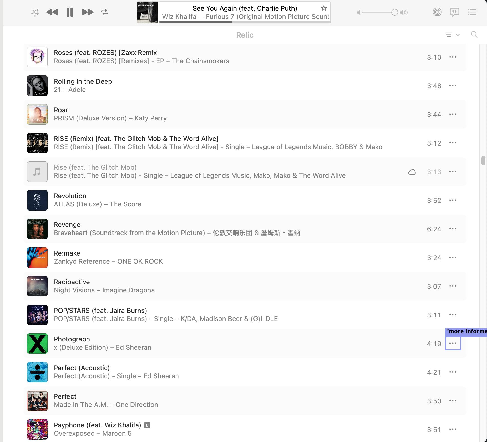
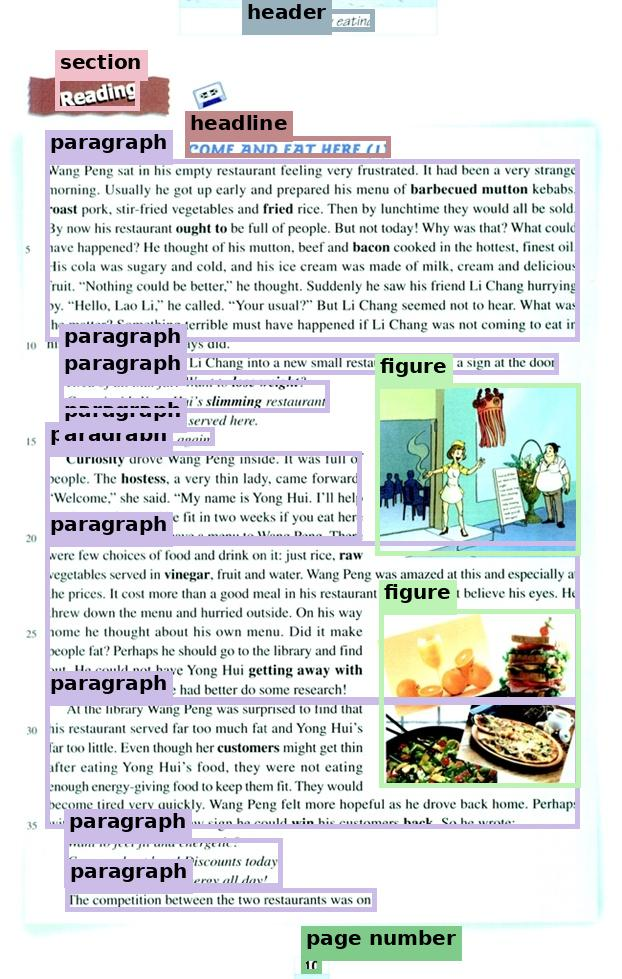
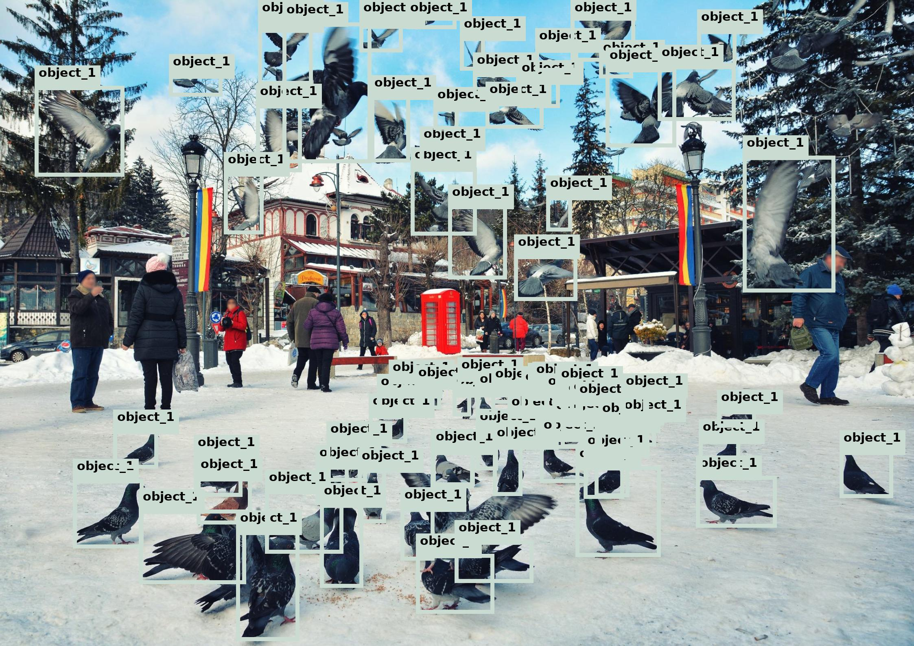
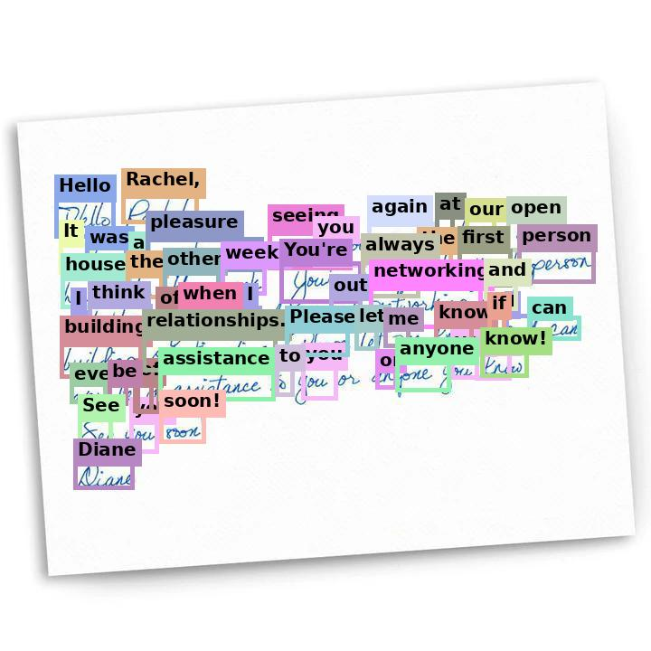
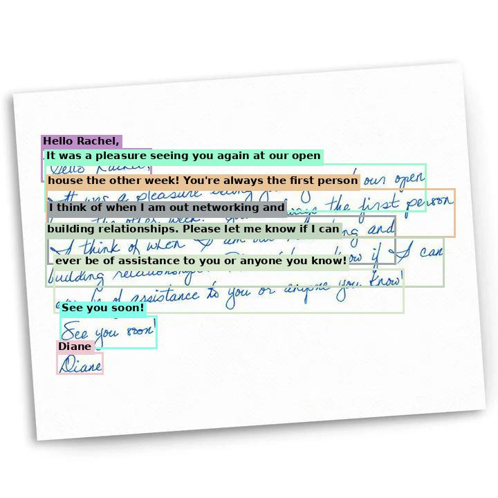
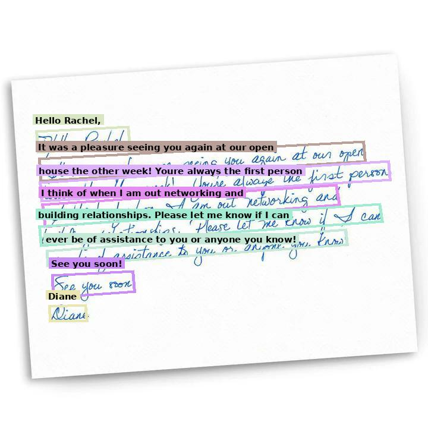
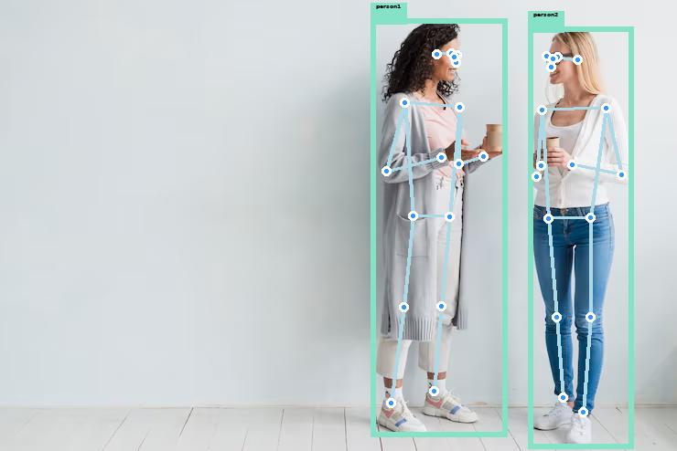
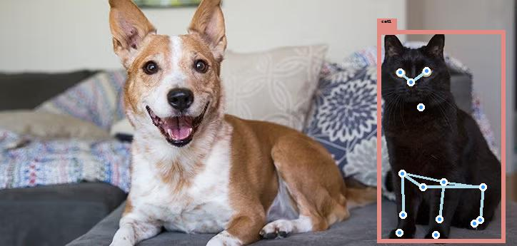

<div align=center>
  
</div>

<h1 align="center">Detect Anything via Next Point Prediction</h1>

<div align=center>

<p align="center">
  <a href="https://rex-omni.github.io/">
    
  </a>
  <a href="https://arxiv.org/abs/2506.04034">
    
  </a>
  <a href="https://huggingface.co/IDEA-Research/Rex-Omni">
    
  </a>
  <a href="https://huggingface.co/spaces/Mountchicken/Rex-Omni">
    
  </a>
  
</p>

</div>

> Rex-Omni is a 3B-parameter Multimodal Large Language Model (MLLM) that redefines object detection and a wide range of other visual perception tasks as a simple next-token prediction problem.

<p align="center"></p>


# News 🎉
- [2025-10-14] Rex-Omni is released.

# Table of Contents


- [News 🎉](#news-)
- [Table of Contents](#table-of-contents)
  - [1. Installation ⛳️](#1-installation-️)
  - [2. Quick Start: Using Rex-Omni for Detection](#2-quick-start-using-rex-omni-for-detection)
      - [Initialization parameters (RexOmniWrapper)](#initialization-parameters-rexomniwrapper)
      - [Inference parameters (rex.inference)](#inference-parameters-rexinference)
  - [3. Cookbooks](#3-cookbooks)
  - [4. Gradio Demo](#4-gradio-demo)
    - [Quick Start](#quick-start)
    - [Available Options](#available-options)
  - [5. LICENSE](#5-license)
  - [6. Citation](#6-citation)


## 1. Installation ⛳️

```bash
conda create -n rexomni -m python=3.10
pip install torch==2.6.0 torchvision==0.21.0 --index-url https://download.pytorch.org/whl/cu124
git clone https://github.com/IDEA-Research/Rex-Omni.git
cd Rex-Omni
pip install -v -e .
```

Test Installation
```bash
CUDA_VISIBLE_DEVICES=1 python tutorials/detection_example/detection_example.py
```

If the installation is successful, you will find a visualization of the detection results at `tutorials/detection_example/test_images/cafe_visualize.jpg`

## 2. Quick Start: Using Rex-Omni for Detection
Below is a minimal example showing how to run object detection using the `rex_omni` package.

```python
from PIL import Image
from rex_omni import RexOmniWrapper, RexOmniVisualize

# 1) Initialize the wrapper (model loads internally)
rex = RexOmniWrapper(
    model_path="IDEA-Research/Rex-Omni",   # HF repo or local path
    backend="transformers",                # or "vllm" for high-throughput inference
    # Inference/generation controls (applied across backends)
    max_tokens=2048,
    temperature=0.0,
    top_p=0.05,
    top_k=1,
    repetition_penalty=1.05,
)

# 2) Prepare input
image = Image.open("tutorials/detection_example/test_images/cafe.jpg").convert("RGB")
categories = [
    "man", "woman", "yellow flower", "sofa", "robot-shope light",
    "blanket", "microwave", "laptop", "cup", "white chair", "lamp",
]

# 3) Run detection
results = rex.inference(images=image, task="detection", categories=categories)
result = results[0]

# 4) Visualize
vis = RexOmniVisualize(
    image=image,
    predictions=result["extracted_predictions"],
    font_size=20,
    draw_width=5,
    show_labels=True,
)
vis.save("tutorials/detection_example/test_images/cafe_visualize.jpg")
```

#### Initialization parameters (RexOmniWrapper)
- **model_path**: Hugging Face repo ID or a local checkpoint directory for the Rexe-Omni model.
- **backend**: "transformers" or "vllm".
  - **transformers**: easy to use, good baseline latency.
  - **vllm**: high-throughput, low-latency inference. Requires the `vllm` package and a compatible environment.
- **max_tokens**: Maximum number of tokens to generate for each output.
- **temperature**: Sampling temperature; higher values increase randomness (0.0 = deterministic/greedy).
- **top_p**: Nucleus sampling parameter; model samples from the smallest set of tokens with cumulative probability ≥ top_p.
- **top_k**: Top-k sampling; restricts sampling to the k most likely tokens.
- **repetition_penalty**: Penalizes repeated tokens; >1.0 discourages repetition.
- Optional advanced settings (supported via kwargs when constructing the wrapper):
  - Transformers: `torch_dtype`, `attn_implementation`, `device_map`, `trust_remote_code`, etc.
  - VLLM: `tokenizer_mode`, `limit_mm_per_prompt`, `max_model_len`, `gpu_memory_utilization`, `tensor_parallel_size`, `trust_remote_code`, etc.

#### Inference parameters (rex.inference)
- **images**: A single `PIL.Image.Image` or a list of images for batch inference.
- **task**: One of `"detection"`, `"pointing"`, `"visual_prompting"`, `"keypoint"`, `"ocr_box"`, `"ocr_polygon"`, `"gui_grounding"`, `"gui_pointing"`.
- **categories**: List of category names/phrases to detect or extract, e.g., `["person", "cup"]`. Used to build task prompts.
- **keypoint_type": Type of keypoints for keypoint detection task. Options: "person", "hand", "animal"
- **visual_prompt_boxes**: Reference bounding boxes for visual prompting task. Format: [[x0, y0, x1, y1], ...] in absolute coordinates

Returns a list of dictionaries (one per input image). Each dictionary includes:
- **raw_output**: The raw text generated by the LLM.
- **extracted_predictions**: Structured predictions parsed from the raw output, grouped by category.
  - For detection: `{category: [{"type": "box", "coords": [x0,y0,x1,y1]}, ...], ...}`
  - For pointing:  `{category: [{"type": "point", "coords": [x0,y0]}, ...], ...}`
  - For polygon: `{category: [{"type": "polygon", "coords": [x0,y0, ...]}, ...], ...}`
  - For keypointing: Structured Json

Tips:
- For best performance with VLLM, set `backend="vllm"` and tune `gpu_memory_utilization` and `tensor_parallel_size` according to your GPUs.

## 3. Cookbooks

We provide comprehensive tutorials for each supported task. Each tutorial includes both standalone Python scripts and interactive Jupyter notebooks.

|       Task       |                                                                Applications                                                               |   Demo |                  Python Example                    |                     Notebook                     |
|:----------------:|:-----------------------------------------------------------------------------------------------------------------------------------------:|:-----------------------------------------------------:|:------------------------------------------------:|:------------------------------------------------:|
| Detection |                               `object detection`                                 |   | [code](tutorials/detection_example/detection_example.py)   | [notebook](tutorials/detection_example/_full_notebook.ipynb) |
|                  |                         `object referring`                      |    | [code](tutorials/detection_example/referring_example.py)      |       [notebook](tutorials/detection_example/_full_notebook.ipynb)                                           |
|                  | `gui grounding` |  | [code](tutorials/detection_example/gui_grounding_example.py)  |       [notebook](tutorials/detection_example/_full_notebook.ipynb)                                           |
|                  |                    `layout grounding`    |          | [code](tutorials/detection_example/layout_grouding_examle.py) |       [notebook](tutorials/detection_example/_full_notebook.ipynb)                                             |
| Pointing |                               `object pointing`            |                  |   [code](tutorials/pointing_example/object_pointing_example.py)   | [notebook](tutorials/pointing_example/_full_notebook.ipynb) |
|                  |                         `gui pointing`    |                    | [code](tutorials/pointing_example/gui_pointing_example.py)      |       [notebook](tutorials/pointing_example/_full_notebook.ipynb)                                           |
|                  | `affordance pointing` |  | [code](tutorials/pointing_example/affordance_pointing_example.py)  |       [notebook](tutorials/pointing_example/_full_notebook.ipynb)                                           |
| Visual prompting | `visual prompting` |  | [code](tutorials/visual_prompting_example/visual_prompt_example.py) | [notebook](tutorials/visual_prompting_example/_full_tutorial.ipynb) |
| OCR | `ocr word box` |  | [code](tutorials/ocr_example/ocr_word_box_example.py) | [notebook](tutorials/ocr_example/_full_tutorial.ipynb) |
|                  | `ocr textline box` |  | [code](tutorials/ocr_example/ocr_textline_box_example.py) |       [notebook](tutorials/ocr_example/_full_tutorial.ipynb)                                           |
|                  | `ocr polygon` |  | [code](tutorials/ocr_example/ocr_polygon_example.py) |       [notebook](tutorials/ocr_example/_full_tutorial.ipynb)                                           |
| Keypointing | `person keypointing` |  | [code](tutorials/keypointing_example/person_keypointing_example.py) | [notebook](tutorials/keypointing_example/_full_tutorial.ipynb)|
|             | `animal keypointing`   |                          |  [code](tutorials/keypointing_example/animal_keypointing_example.py)                                                |       [notebook](tutorials/keypointing_example/_full_tutorial.ipynb)                                           |
| Other | `batch inference` |  | [code](tutorials/other_example/batch_inference.py) ||

## 4. Gradio Demo


We provide an interactive Gradio demo that allows you to test all Rex-Omni capabilities through a web interface.

### Quick Start
```bash
# Launch the demo
CUDA_VISIBLE_DEVICES=0 python demo/gradio_demo.py --model_path IDEA-Research/Rex-Omni

# With custom settings
CUDA_VISIBLE_DEVICES=0 python demo/gradio_demo.py \
    --model_path IDEA-Research/Rex-Omni \
    --backend vllm \
    --server_name 0.0.0.0 \
    --server_port 7890
```

### Available Options
- `--model_path`: Model path or HuggingFace repo ID (default: "IDEA-Research/Rex-Omni")
- `--backend`: Backend to use - "transformers" or "vllm" (default: "transformers")
- `--server_name`: Server host address (default: "192.168.81.138")
- `--server_port`: Server port (default: 5211)
- `--temperature`: Sampling temperature (default: 0.0)
- `--top_p`: Nucleus sampling parameter (default: 0.05)
- `--max_tokens`: Maximum tokens to generate (default: 2048)

## 5. LICENSE

Rex-Omni is licensed under the [IDEA License 1.0](LICENSE), Copyright (c) IDEA. All Rights Reserved.

## 6. Citation
Rex-Omni comes from a series of prior works. If you’re interested, you can take a look.

- [RexThinker](https://arxiv.org/abs/2506.04034)
- [RexSeek](https://arxiv.org/abs/2503.08507)
- [ChatRex](https://arxiv.org/abs/2411.18363)
- [DINO-X](https://arxiv.org/abs/2411.14347)
- [Grounidng DINO 1.5](https://arxiv.org/abs/2405.10300)
- [T-Rex2](https://link.springer.com/chapter/10.1007/978-3-031-73414-4_3)
- [T-Rex](https://arxiv.org/abs/2311.13596)


```text

```